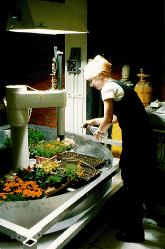

1970 年代，一位日本農夫發現了一種把事情做得更好的方法——那就是，**不要去做它**。

Frances Moore Lappé 在福岡正信（Masanobu Fukuoka）的《一根稻草的革命》（_The One-Straw Revolution_）序言中，這樣描述他靈光乍現的那一刻：

> 有一天，他偶然經過一片多年無人使用、也從未翻耕的荒地，基本的想法就在那時出現了。他看見那裡雜草與青草叢生。

	從那以後，他不再為了種稻而灌水淹田。他也不再於春天播種，而是在秋天直接把稻種撒在田地表面——也就是種子在自然狀態下原本會落下的時節……

	一旦確保條件已經朝著有利作物生長的方向發展，福岡先生便盡可能少去干預田裡的植物與動物群落。

福岡經過多年實踐、不斷完善的方法，後來被稱為「無為農法」（do-nothing farming）。

但這絕不代表它很容易。

實行「無為農法」的人，反而得比一般農夫更細心、更敏銳地感受土地與季節。畢竟，福岡這套巧妙的方法，是他花了幾十年密切觀察天氣變化、昆蟲、鳥類、樹木、土壤，以及它們彼此之間的關係之後，才逐漸摸索出來的。

在《一根稻草的革命》中，福岡對自己完善的這套方法感到自豪，完全有其道理。

「無為農法」不僅需要更少的勞力，不用機器，也不需要肥料；更重要的是，它會讓土壤一年比一年肥沃，而大多數農地卻在逐年耗損土壤。

儘管外界抱持懷疑，福岡農場的收成依然與其他農場相當，甚至更多。

他寫道：

> 「恐怕很難找到比這更簡單的穀物栽培方法了。證據此刻就在你眼前逐漸成熟。」

福岡其中一項洞見是：**既有的生態系統本身，就存在著一種自然的智慧。**

因此，最有智慧的耕作方式，反而是盡可能少加干預。

這顯然要求我們重新思考的不只是「什麼叫做農業」，甚至可能連「什麼叫做進步」都得重新想過。

> 我所走的這條路，這種自然農法，在大多數人眼中顯得非常奇怪。最初，人們把它理解成對科學進步與魯莽發展的一種反動。

	但我一直以來在鄉下種田所做的，只不過是想證明一件事：人類其實什麼都不知道。

	因為整個世界正以驚人的力量朝著完全相反的方向奔去，所以我看起來或許像是落後於時代。

	但我始終堅信，我所走的這條路，才是最合理的一條路。

——福岡正信，《一根稻草的革命》

在我看來，福岡其實是一位**發明家**。

一般來說，我們總把「發明」與「進步」聯想到增加某些東西，或發展出某種新科技。

那麼，如果所謂的向前邁進，真正需要做的其實是**拿掉一些東西**呢？

又或者，前進意味著朝一個在我們眼中看起來像是在「倒退」的方向走呢？

福岡寫道：

> 「這套方法與現代農業技術完全背道而馳。它乾脆把科學知識以及傳統農業經驗全都丟出了窗外。」

這種讓自己融入更大的生態秩序之中的做法，與 John McPhee 在《控制自然》（_Control of Nature_）中描述的故事，幾乎形成一種滑稽的對照。

在那些故事裡，我們看見的是近乎莎士比亞式的人類愚行：人一次又一次試圖征服環境中崇高而龐大的自然力量，然後一次又一次失敗。

例如，人類曾花上數十年時間，企圖阻止密西西比河改變河道。

任何藝術家或作家，大概都會對這種對比感到熟悉。

為什麼我們坐下來，硬逼自己「想一個點子」時，常常什麼都想不出來？

又或者，即使真的硬擠出了一個想法，為什麼它總讓人覺得陳腐、生硬又刻意？

為什麼最好的想法，反而總是在沒有受到邀請的情況下，出現在最奇怪的時刻——像一隻調皮的松鼠突然從灌木叢裡竄出來，直撲到我們眼前？

我認為，關鍵在於：

**你究竟認為，是誰在「生產」想法？而想法又是在什麼地方產生的？**

我們很容易說：「是『我』產生了這個想法。」

可是每當我完成一件作品之後，我往往很難說清楚，它究竟是怎麼發生的。

它從哪裡開始？

中間經過了什麼路線？

最後又為什麼停在這個地方？

在一座「無為農場」裡，其實也發生著類似的事情。

到了這裡，那些帶有明確施動者的及物動詞，似乎突然變得不太夠用了。

說福岡「耕種這片土地」，聽起來好像不完全正確。

比較接近實際情況的說法或許是：

**他在與土地合作。**

而透過這種合作，他創造出了讓某些生命得以生長的條件。

> 即使不是全部，大多數事物都已經被描述過、編目過、拍攝過、談論過，或登記記錄過。

	因此，在接下來的篇幅裡，我真正想描述的反而是其餘那些東西：

	那些一般不會被記下來的東西；

	那些沒有人注意的東西；

	那些看起來毫不重要的東西。

	當什麼都沒有發生，只有天氣、人、汽車和雲朵經過時，究竟發生了什麼？

——Georges Perec，《巴黎一個地方的窮盡嘗試》（_Attempt at Exhausting a Place in Paris_）

從成年以後，我一直都知道，**散步是我最容易思考的時候。**

走路並不只是把你那個「正在思考的大腦」——彷彿它是一座與外界隔絕的孤島——搬到戶外去而已。

**走路本身就是思考。**

事實上，David Abram 在《感官的魔法：超越人類世界中的知覺與語言》（_The Spell of the Sensuous: Perception and Language in a More-than-Human World_）一書中甚至提出：

或許並不是「我們」在思考。

反而是**環境透過我們在思考**。

智慧與思想並不只存在於「自我」之中，同樣也存在於我們周遭。

Abram 寫道：

> 「每一個地方，都是一種獨特的心智狀態。而構成那個地方、居住其中的眾多存在——蜘蛛與樹蛙絲毫不亞於人類——全都共同參與，也共同分享著那個地方特有的心智。」

這其實沒有聽起來那麼玄。

認知科學的一些研究已經指出，我們所遇見的「環境」並不是一個靜止不動的東西，而我們自己也不是。

Francisco Varela、Evan Thompson 與 Eleanor Rosch 在《具身心智》（_The Embodied Mind_）——一本把認知科學與佛教思想放在一起探討的著作——中這樣寫道：

> 「認知並不是一個預先存在的心智，去再現一個預先存在的世界；認知其實是一個世界與一個心智共同生成的過程……」

（強調為我所加。）

在整本書中，作者逐步建立出一種認知模型：

**心智與環境並不是兩個彼此分離的東西。**

它們從彼此接觸的那一刻起，就在共同生成彼此。

---

「The Telegarden 是一件藝術裝置，讓網路使用者可以觀看並與一座遠端的真實花園互動。參與者可以透過工業機械手臂輕柔的動作，播種、澆水，並觀察幼苗的生長情況。」

---

無論企業多麼希望把想法當成產品，**想法其實並不是產品。**

想法，是我們與某個其他事物相遇時產生的交會點。

那個事物可能是一本書。

可能是一場與朋友的談話。

也可能只是一棵樹給你的細微暗示。

想法甚至真的可能從雲裡冒出來——前提是，你正在看那些雲。

換句話說：

**想法就像意識本身，是一種湧現的性質（emergent property）。**

而我們所謂的「思考」，與其說是一種生產，也許更接近一種**參與**。

如果我們能帶著謙遜與敬畏，接受這樣一種對心智的理解，也許最後，我們會對那裡究竟能長出什麼感到驚訝。

---

呼吸。

---

為了配合這篇文章，我在 Are.na 上建立了一個名為 **「How to grow an idea」** 的頻道：

[How to grow an idea — Are.na](https://www.are.na/the-creative-independent-1522276020/how-to-grow-an-idea)

你會在那裡找到一些散落在各種生命與生長形態之間的思想種子：

黏菌、攀纏的藤蔓、網路花園，以及椋鳥群在天空中翻騰變化的群飛景象。

其中有一段 John Cage 的訪談。

他坐在一扇打開的窗戶旁，為那些從未被譜寫下來的音樂感到欣喜。

那也許會讓你想起福岡。

Scott Polach 的作品或許也一樣——在那件作品裡，一群觀眾為落日鼓掌。

這個頻道從一句「記得呼吸」開始。

最後則以一份「去睡個午覺吧」的邀請結束。

希望在這兩者之間的某個地方，

**你會遇見一些新的東西。**
